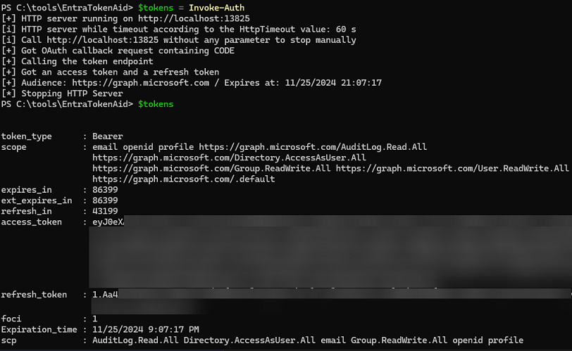
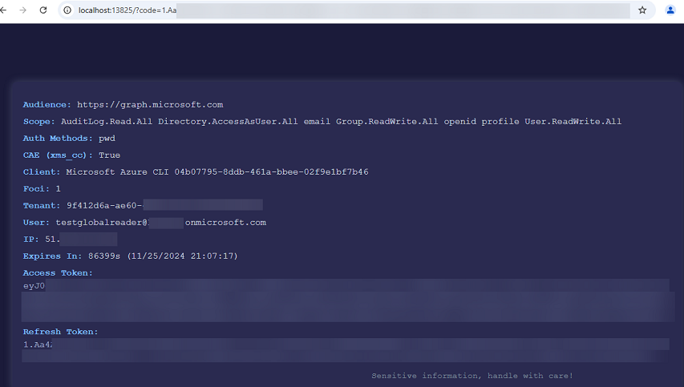

# EntraTokenAid

EntraTokenAid is a PowerShell module to simplify OAuth workflows with Microsoft Entra ID, to get the access and refresh token for different APIs using different clients.

Accessing cleartext access and refresh tokens for various MS APIs (e.g., MS Graph) is often a requirement during engagements and research, especially using pre-consented clients (e.g., AzureCLI) to avoid additional consent prompts. Tokens are needed not only for manual enumeration via APIs but also for tools like AzureHound or GraphRunner, which require a valid refresh token. 

With more customers starting to block the Device Code Flow, alternative authentication methods for obtaining cleartext refresh tokens are becoming increasingly important. While using AzureCLI modules is a common solution, its installation may not always be feasible—especially on customer systems. Other alternatives like roadtx require Python, which might not be ideal in customer environments.

This tool should bridges this gap with a lightweight, standalone PowerShell solution that works even on the customers Windows systems.


---

## Features

- **No dependencies**: A pure PowerShell single-file module that works on Windows systems (tested in PS 5&7).
- **Interactive Authentication**: Supports both OAuth Auth Code Flow and Device Code Flow.
- **Flexible Refresh**: Obtain access tokens for any API and client using refresh tokens.
- **CAE Support**: By default, requests CAE (Continuous Access Evaluation) capable access tokens, valid for 24 hours.
- **JWT Parsing**: Automatically decodes access tokens to display details (e.g., scope, tenant, IP, authentication methods).
- **Avoiding Consent**: By default, the tool uses the Azure CLI client ID, enabling many MS Graph API actions without additional consent due to pre-consented permissions.
- **Parameters**: A wide range of parameters allow you to customize the tool's behavior, such as enabling features like PKCE, CAE, and more, providing greater control during usage.
- **Automation-Friendly**: Enables automated OAuth Auth Code Flow tests by disabling user selection, with the gathered tokens and claims exported to a CSV file.
---

## Images
Performing an authentication and showing the gathered tokens and other useful information:



Tokens and useful JWT claims are directly displayed in the OAuth callback request on the local server:



Using the obtained refresh token to get new tokens on another API and using another client (Azure PowerShell):


---
## Installation

1. Clone the repository:
    ```powershell
   git clone https://github.com/zh54321/TokenAid.git
   ```
2. Import the module before usage:
   ```powershell
   Import-Module ./TokenAid/TokenAid.psm1
   ```

---

## Getting Started

The module includes the following commands:

| Command                  | Description                                                      |Default behavior|
|--------------------------|------------------------------------------------------------------|----|
| `Invoke-Auth`            | Perform authentication (auth code flow) and retrieve tokens.          |API: MS Graph / Client: Azure CLI / CAE: Yes|
| `Invoke-DeviceCodeFlow`  | Authenticate via the device code flow.|API: MS Graph / Client: Azure CLI|
| `Invoke-Refresh`         | Get a new access token using the refresh token. |API: MS Graph / Client: Azure CLI|
| `Invoke-ParseJwt`        | Decode a JWT and display its body properties.                      |-|

---

## Module Functions

### `Invoke-Auth`

Performs OAuth authentication using the Authorization code flow.
By default it a Tokens from the MS Graph API using Azure CLI as client are requested.

#### Parameters
All parameters are optional.

| Parameter            | Description                                                                 | Default Value                                     |
|----------------------|-----------------------------------------------------------------------------|---------------------------------------------------|
| **ClientID**         | Specifies the client ID for authentication.                                 | `04b07795-8ddb-461a-bbee-02f9e1bf7b46` (Azure CLI)|
| **Scope**            | Scopes (space sperated) to be requested.                                    | `default offline_access`                          |
| **Api**              | API for which the access token is needed.                                   | `graph.microsoft.com`                             |
| **Tenant**           | Specific tenant id.                                                         | `organizations`                                   |
| **Port**             | Local port to listen on for the OAuth callback.                             | `13824`                                           |
| **HtmlOut**          | Display the tokens in the OAuth callback in a browser.                      | `true`                                            |
| **TokenOut**         | If provided, outputs the raw token to console.                              | `false`                                           |
| **DisableJwtParsing**| Skips the parsing of the JWT.                                               | `false`                                           |
| **DisablePrompt**    | Suppresses interactive user selection. Used logged-in user directly         | `false`                                           |
| **HttpTimeout**      | Time in seconds the HTTP Server waiting for OAuth callback.                 | `60`                                              |
| **DisablePKCE**      | Disables the PKCE usage.                                                    | `false`                                           |
| **DisableCAE**       | Disables Continuous Access Evaluation (CAE) support.                        | `false`                                           |
| **Reporting**        | If provided, enables detailed token logging to csv.                         | `false`                                           |  


#### Examples
Perform authentication and retrieve tokens with default options (MS Graph API / Azure CLI as client):
```powershell
$Tokens = Invoke-Auth
```

Perform authentication on Azure ARM API
```powershell
$Tokens = Invoke-Auth -API "management.azure.com"
```

Perform authentication and retrieve a token using a custom client id and scope:
```powershell
$Tokens = Invoke-Auth -ClientID "your-client-id" -Scope "offline_access Mail.Read"
```

Connect to MS Graph API one-liner:
```powershell
Connect-MgGraph -AccessToken ((Invoke-Auth).access_token | ConvertTo-SecureString -AsPlainText -Force)
```

Perform authentication and use with AzureHound:
```powershell
$Tokens = Invoke-Auth
.\azurehound.exe --refresh-token $Tokens.refresh_token list --tenant $Tokens.tenant -o output-all.json
```

Perform automated testing by disabling user selection (already logged-in user in the browser will be used), activate reporting, set the HTTP timeout and loop through a list of client IDs:
```powershell
# Define the array of GUIDs
$guids = @(
    "1950a258-227b-4e31-a9cf-717495945fc2",
    "7ae974c5-1af7-4923-af3a-fb1fd14dcb7e",
    "5572c4c0-d078-44ce-b81c-6cbf8d3ed39e"
)

# Loop through each GUID in the array
foreach ($guid in $guids) {
    Invoke-Auth -ClientID $guid -DisablePrompt -Reporting -HttpTimeout 5
}
```

---

### `Invoke-DeviceCodeFlow`

Authenticate using the device code flow. The browser is opened automatically, and the required code is copied to the clipboard.

#### Parameters
All parameters are optional.
| Parameter              | Description                                                                 | Default Value                                     |
|----------------------  |-----------------------------------------------------------------------------|---------------------------------------------------|
| **ClientID**           | Specifies the clientID for authentication.                                  | `04b07795-8ddb-461a-bbee-02f9e1bf7b46` (Azure CLI)|
| **Api**                | API for which the access token is needed.                                   | `graph.microsoft.com`                             |
| **UserAgent**          | User agent used. | `Mozilla/5.0 (Windows NT 10.0; Win64; x64) AppleWebKit/537.36 (KHTML, like Gecko) Chrome/130.0.0.0 Safari 537`|  
| **Tenant**             | Specific tenant id.                                                         | `organizations`                                   |
| **TokenOut**           | If provided, outputs the raw token to console.                              | `false`                                           |
| **DisableJwtParsing**  | Skips the parsing of the JWT.                                               | `false`                                           |
| **DisableBrowserStart**| Disables the automatic start of the browser.                                | `false`                                           |
| **Reporting**          | If provided, enables detailed token logging to csv.                         | `false`                                           |  


#### Example

Simpy start of the device code flow with default options.
```powershell
Invoke-DeviceCodeFlow
```
Get tokens for the AzureARM API
```powershell
Invoke-DeviceCodeFlow -API management.azure.com
```
Authenticate using the device code flow specifiy the client id and api
```powershell
$Token = Invoke-DeviceCodeFlow -ClientID "your-client-id" -Api "graph.microsoft.com"
```
Connect to MS Graph API one-liner
```powershell
Connect-MgGraph -AccessToken ((Invoke-DeviceCodeFlow).access_token | ConvertTo-SecureString -AsPlainText -Force)
```

Perform authentication and use with AzureHound:
```powershell
$Tokens = Invoke-DeviceCodeFlow
.\azurehound.exe --refresh-token $Tokens.refresh_token list --tenant $Tokens.tenant -o output-all.json
```

---

### `Invoke-Refresh`

Uses a refresh token to obtain a new access token, optionally for the same or a different API or client (for FOCI tokens).

#### Parameters

| Parameter            | Description                                                                 | Default Value                                     |
|----------------------|-----------------------------------------------------------------------------|---------------------------------------------------|
| **RefreshToken**     | Refresh token to used (MANDETORY).                                           | -                                                 |
| **ClientID**         | Specifies the client ID for authentication.                                 | `04b07795-8ddb-461a-bbee-02f9e1bf7b46` (Azure CLI)|
| **Scope**            | Scopes (space sperated) to be requested.                                    | `default offline_access`                          |
| **Api**              | API for which the access token is needed.                                   | `graph.microsoft.com`                             |
| **Tenant**           | Specific tenant id.                                                         | `organizations`                                   |
| **TokenOut**         | If provided, outputs the raw token to console.                              | `false`                                           |
| **DisableJwtParsing**| Skips the parsing of the JWT.                                               | `false`                                           |
| **DisableCAE**       | Disables Continuous Access Evaluation (CAE) support.                        | `false`                                           |
| **Reporting**        | If provided, enables detailed token logging to csv.                         | `false`                                           |  

#### Example
Use the refresh token to get new tokens:
```powershell
Invoke-Refresh -RefreshToken $Tokens.refresh_token
```

Refresh using the same client id, api and scopes used before:
```powershell
Invoke-Refresh -RefreshToken $Tokens.refresh_token -Scope $Tokens.scp -Api $Tokens.api
```

Get tokens for the AzureARM API:
```powershell
Invoke-Refresh -RefreshToken $Tokens.refresh_token -Api management.azure.com
```


---

### `Invoke-ParseJwt`

Decodes and analyzes a JWT, extracting and displaying its claims.
The function use used automatically by other functions but can be used manually as well.

#### Parameters

| Parameter   | Description                                                        | Default Value                                     |
|-------------|--------------------------------------------------------------------|---------------------------------------------------|
| **JWT**     | The JWT to decode (MANDETORY).                                     | -                                                 |

#### Example
Parse a JWT and display its claims:
```powershell
Invoke-ParseJwt -JWT $Tokens.access_token

```

---


## Internal Functions

The following functions are for internal use and are not exported by the module:

- `Invoke-PrintTokenInfo` Formats and displays JWT information in console.
- `Invoke-Reporting` Logs information to a CSV file for later analysis or comparison.

## Security Warning

It is **discouraged** to pass sensitive information, such as **Access Tokens** or escpecially **Refresh Tokens**, directly in the command line. 


Command-line arguments are stored by default in the PowerShell history file in your profile, events, or security monitoring tools.
Attackers which gain access to those files may abuse credentials like long-lived refresh tokens.

### Recommendations:
- **Use variables** to store sensitive information in your script instead of passing it directly in the command line.
  - Example:
  ```powershell
  #Store the tokens in a variable
  $Tokens = invoke-auth

  #Work with the variable instead the token itself:
  Invoke-Refresh -RefreshToken $Tokens.refresh_token
  Invoke-ParseJwt -Jwt $Tokens.access_token
  ```

- **Clear your PowerShell history** after use to ensure sensitive data is at least not retained in the PS history files (all 3 commands):
  ```powershell
  Clear-History
  [Microsoft.PowerShell.PSConsoleReadLine]::ClearHistory()
  set-content -Path (Get-PSReadLineOption).HistorySavePath -value ' '
   ```

## Credits

This module includes a JWT parsing method that was initially adapted from the following blog post:

- [Decode JWT Access and ID Tokens via PowerShell](https://www.michev.info/blog/post/2140/decode-jwt-access-and-id-tokens-via-powershell) by [Michev](https://www.michev.info)
